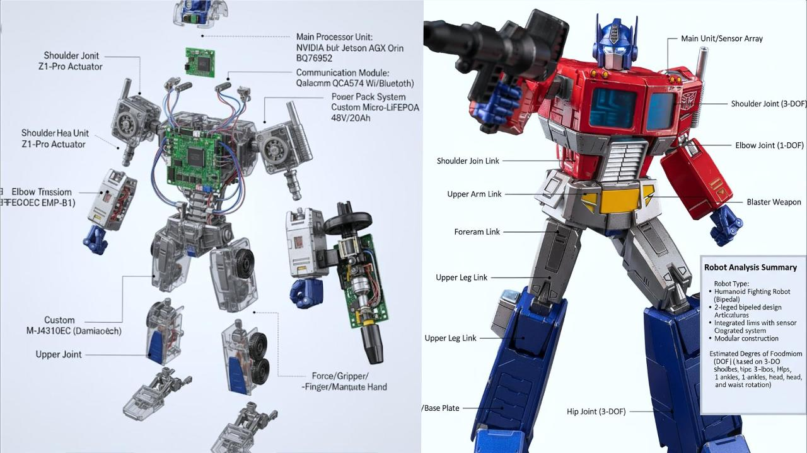

# RoboGen

## 🤖 从概念到蓝图：多模态AI驱动的机器人可视化设计工作流

[](LICENSE)
[](https://www.python.org/)
[](https://flask.palletsprojects.com/)

> 🏆 **Nvidia Hackathon 参赛作品** - MVP团队  
> 🎥 **项目演示视频**: [https://www.bilibili.com/video/BV1qbYjzVEHV](https://www.bilibili.com/video/BV1qbYjzVEHV)

**RoboGen** 是一个基于多模态大模型（Multimodal LLM）的机器人设计可视化平台。用户只需上传一张机器人概念图，即可通过AI驱动的链式工作流，自动生成从技术分析到仿真预览的完整设计蓝图，实现机器人开发的"一键可视化"。



## ✨ 核心特性

### 🔄 智能链式工作流

- **一步接一步**：上一步生成的图像作为下一步的输入，形成连贯的视觉生成流
- **多角色扮演**：单一AI模型扮演结构分析师、机械设计师、BOM工程师等多种专业角色
- **端到端自动化**：从概念识别到仿真预览的全流程自动化处理

### 🎯 专业输出成果

1. **📊 技术分析图** - 智能识别机器人类型和关键结构特征
2. **🔧 3D爆炸图** - 精细化内部机械与电子结构可视化
3. **📐 工程蓝图** - 标准四视图工程参考图纸
4. **📋 可视化BOM** - 专业物料清单图表，包含具体组件型号
5. **🎮 仿真预览** - NVIDIA Isaac Sim环境的仿真场景预览

### 🧠 隐式知识驱动

- **无数据库设计**：巧妙利用AI模型内置的海量工程知识
- **智能组件匹配**：自动推荐符合行业标准的组件型号（如宇树科技Unitree电机）
- **专业级输出**：生成符合工业设计规范的专业图纸

## 🚀 快速开始

### 📋 环境要求

- Python 3.8+
- Flask 2.0+
- Google Gemini API 访问权限

### 📦 安装依赖

```bash
# 克隆项目
git clone https://github.com/RobotBase/RoboGen.git
cd RoboGen

# 安装依赖包
pip install -r requirements.txt
```

## ⚙️ 设置配置文件

复制配置示例文件并填入你的真实配置：

```bash
cp config.example.json config.json
```

然后编辑 `config.json` 文件，填入你的真实API密钥：

```json
{
    "google_api_key": "你的Google API密钥",
    "model_name": "gemini-2.5-flash-image-preview",
    "secret_key": "你的Flask应用密钥"
}
```

## 运行应用

```bash
python robogen.py
```

应用将在 `http://localhost:5000` 启动。

## 注意事项

- 请勿将包含真实API密钥的 `config.json` 文件提交到版本控制
