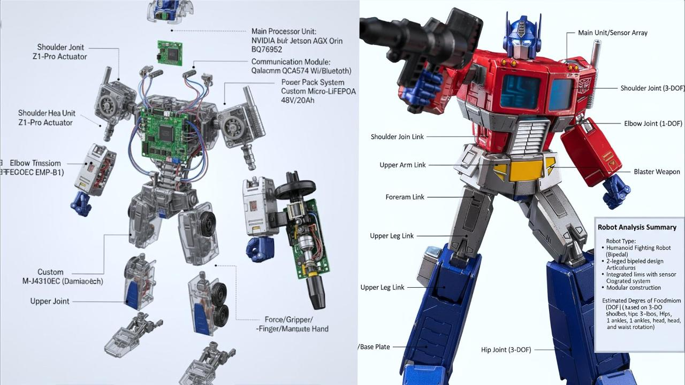

# Nvidia Hackathon

## 参赛项目书

- 参赛队名：MVP
- 团队成员：张振尧 李佳瑞 王海翔 王佩哲
- 项目介绍视频地址：[https://www.bilibili.com/video/BV1qbYjzVEHV](https://www.bilibili.com/video/BV1qbYjzVEHV)

## RoboGen

### 《从概念到蓝图：多模态AI驱动的机器人可视化设计工作流》

副标题：RoboGen团队利用生成式AI工作流，赋能机器人开发“一键可视化”

机器人产品开发流程复杂，涉及概念设计、结构分析、组件选型和仿真预览等多个环节，存在周期长、门槛高、沟通成本高等痛点。传统开发模式严重依赖工程师的个人经验，且在早期概念阶段缺乏直观、快速的可视化工具，制约了创意的快速迭代。

为突破这一瓶颈，我们开发了一个基于多模态大模型（Multimodal LLM）的机器人设计可视化平台。该平台将从一张概念图到仿真预览的全流程，拆解为一系列由AI驱动的、环环相扣的视觉生成步骤。通过一个清晰的Web界面，用户只需上传一张图片，即可逐步生成专业的设计分析图、3D爆炸图、工程蓝图、物料清单（BOM）图表和仿真环境预览图，实现了从抽象概念到具体设计蓝图的全流程可视化。

### 机器人自动化设计与仿真平台

- 核心理念：将机器人设计的核心环节——结构分析、组件选型、3D建模、BOM生成、仿真准备——转化为一个连贯的、可视化的生成任务。利用强大的多模态AI模型，从一张输入图片开始，逐步生成一系列专业的设计图纸和文档。
- 系统架构：采用简洁高效的Web服务架构，前端负责用户交互和流程展示，后端通过调用核心的AI模型API，根据预设的专业Prompt（提示词）链，执行每一步的图像到图像（Image-to-Image）或图像到文本（Image-to-Text）的生成任务。
- 隐式知识驱动：巧妙地利用多模态大模型在海量数据训练中形成的内部知识库。在生成爆炸图和BOM时，模型被引导去“模拟”查询知识库，从而推荐出符合行业标准的、合理的组件型号，实现了“无数据库的知识库驱动”。
- 端到端可视化：覆盖从用户上传图片进行概念识别，到生成结构分析图、3D爆炸图、工程三视图、可视化BOM，再到NVIDIA Isaac Sim环境的仿真场景预览图的全过程。
- 所见即所得：每一步的输出都是清晰、专业的视觉产物，让设计过程变得直观易懂，极大地降低了非专业人士的理解门槛。

### 本项目致力于

- 降低机器人硬件创新的构思与沟通门槛，让更多创意得以快速、直观地呈现。
- 提升研发工程师的概念设计效率，将精力从繁琐的早期绘图中解放出来。
- 为机器人教育提供一个一站式的、可视化的学习与实践工具。
- 探索大语言模型在复杂工程设计流程中的应用潜力。

### 通过本系统的应用，我们期望能够

- 将机器人产品的概念可视化周期缩短80%以上。
- 大幅降低早期设计的沟通成本和返工率。
- 使机器人设计的魅力展现给更广泛的非专业背景爱好者。

在全球智能化浪潮和产业升级的背景下，本项目为机器人领域的创新提供了一款新颖、高效的前期可视化工具，推动机器人技术的普及与发展。

## RoboGen 技术创新点

### 1\. 基于多模态AI的链式生成工作流

- 流程即Prompt：我们将复杂的机器人设计流程，创造性地转化为一个由多个步骤组成的Prompt链。上一步生成的图像，将作为下一步分析和生成的输入，形成一个连贯、逻辑严密的视觉生成流。
- 单一模型，多种角色：整个工作流由一个统一的多模态大模型（如Google Gemini）驱动。通过在不同步骤赋予其不同的指令（Prompt），该模型能灵活地扮演“结构分析师”、“机械设计师”、“BOM工程师”和“仿真工程师”等多种角色，高效完成多样化任务。

### 2\. 视觉解析与增强生成

- 图像识别与分析：工作流的第一步，利用多模态模型的视觉理解能力，识别用户上传图片中的机器人类型、关键结构和关节，并以图上标注的形式生成直观的技术分析报告图。
- 细节增强与想象生成：在后续步骤中，模型不仅是分析，更是基于分析进行创造性生成。例如，它能“想象”出机器人内部的机械与电子结构，并生成高度精细化的3D爆炸剖面图。

### 3\. 模拟知识库与隐式推理

- Prompt中的虚拟知识库：我们不依赖于外部的物理数据库，而是在Prompt中明确指示模型：“请模拟你拥有一个‘全球机器人产品知识库’”。这引导模型利用其庞大的内部知识储备，为关键部件匹配出具体且合理的产品型号（如 `宇树科技 (Unitree)` 的电机），这是一种轻量级且高效的知识利用方式。
- 可视化BOM生成：基于带有组件标注的爆炸图，模型能够进一步聚合信息，统计数量，并生成一张专业、清晰的可视化物料清单（BOM）图表，而非传统的Excel或CSV文件。

### 4\. 端到端的视觉蓝图产出

- 工程图纸生成：模型能够理解工业设计规范，根据爆炸图生成用于3D建模的专业工程参考图，包含正、侧、顶及等轴侧四个标准视图，为后续实际的3D建模工作提供了高质量的蓝图。
- 仿真场景预览生成：工作流的最后一步，是生成一张模拟NVIDIA Isaac Sim软件界面的截图。这张图片展示了机器人在预设的测试环境中的姿态和关键物理属性，为用户提供了一个关于如何进行下一步物理仿真的直观概念预览。

## RoboGen 项目技术说明

本项目构建了一个以多模态大模型为核心，通过Web界面引导的机器人自动化设计可视化平台。整个工作流程清晰、高效，实现了从概念到一系列设计蓝图的无缝生成。

### 1\. 启动与分析

- 输入形式：用户通过Web界面上传一张机器人图片或概念图。
- 处理流程：
  - 后端接收请求，激活第一步Prompt。
  - 多模态大模型对图片进行分析，生成一张带有关键特征标注和技术摘要的分析图。

### 2\. 设计与生成（串行处理）

- 3D结构与组件生成：
  - 将上一步生成的分析图作为输入，激活第二步Prompt。
  - 模型生成一张精细的3D爆炸图，并从其内部知识中为关键组件匹配具体型号。
- 工程图生成：
  - 将爆炸图作为输入，激活第三步Prompt。
  - 模型生成一张包含四视图的标准化工程蓝图。
- BOM图表生成：
  - 同样基于爆炸图，激活第四步Prompt。
  - 模型提取组件信息，生成一张可视化的BOM图表图片。

### 3\. 仿真准备与预览

- 仿真预览：将工程图或爆炸图作为参考，激活第五步Prompt。
- 模型生成一张模拟的NVIDIA Isaac Sim界面截图，展示了一个基础的仿真场景配置。

### 4\. 技术栈

- AI模型: Google Gemini Pro
- 后端框架: Python FastAPI
- 前端: React或Vue.js

## 团队介绍

我们是一支充满激情和创造力的团队，致力于将前沿AI技术与机器人工程相结合，打造未来的开发工具：

- 张振尧 (项目负责人)
  - 负责项目整体架构设计与规划
  - 主导生成式AI工作流与Prompt链的设计
- 王海翔 (技术负责人)
  - 负责后端系统架构与API实现
  - 设计与优化核心视觉生成流程
- 李佳瑞 (算法专家)
  - 负责多模态识别与生成效果调优
  - 构建核心Prompt模板与工程知识注入
- 王佩哲 (全栈与仿真工程师)
  - 负责前后端交互界面开发与集成
  - 将生成的设计蓝图与NVIDIA Isaac Sim的概念进行对齐与验证

## 总结与展望

### 1\. 收获

- AI应用开发：
  - 深入实践了基于多模态大模型的链式调用与复杂工作流设计。
  - 掌握了通过创新的Prompt Engineering实现工程领域知识的注入与生成。
  - 实现了多模态AI技术在机器人工程设计领域的创新可视化应用。
- 机器人工程自动化：
  - 掌握了机器人3D模型图、BOM清单图等关键设计文档的程序化生成方法。
  - 实现了与NVIDIA Isaac Sim仿真环境在概念预览层面的衔接。
- 工程实践：
  - 完成了从概念理解到仿真预览的全流程可视化系统开发。
  - 提升了复杂AI应用系统的架构设计与工程化能力。

### 2\. 遗憾

- 知识的局限性：项目目前依赖模型的内置知识，其准确性和时效性无法保证。未来希望能结合检索增强生成（RAG）技术，对接真实的外部知识库。
- 输出格式单一：当前系统的产出均为图片格式。一个重要的迭代方向是探索如何生成结构化数据，如可直接用于仿真的USD格式3D模型文件和可编辑的CSV格式BOM表。
- 缺乏反馈闭环：系统目前是单向生成，缺少用户反馈和模型自优化的闭环。

### 3\. 希望

- 期待我们的平台能真正降低机器人开发的早期构思门槛，激发更多人的创造力。
- 帮助中小企业和个人开发者快速可视化他们的想法，加速产品从概念到原型设计的过程。
- 为机器人教育提供创新的工具，推动新一代工程师的培养。
